# Kafka Basics

**What is Kafka?**
Kafka is a system designed for processing real-time data streams.

What is an Event?
An event is a piece of information captured at a specific moment.
Examples include:
- A record of a product being bought, saved in JSON format.
- A full snapshot of a database entry after an update (CDC).
- A simple log message from an app.

## Understanding Event Streaming?
Event streaming means constantly sending out and receiving events as they happen — like a real-time flow of updates between services or systems.

### Phase 1: One event is created
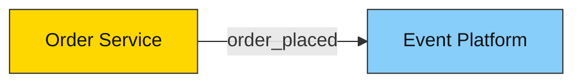

---

### Phase 2: Event flow initiated
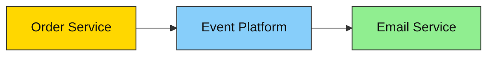

---

### Phase 3: Multiple consumers receive the same event
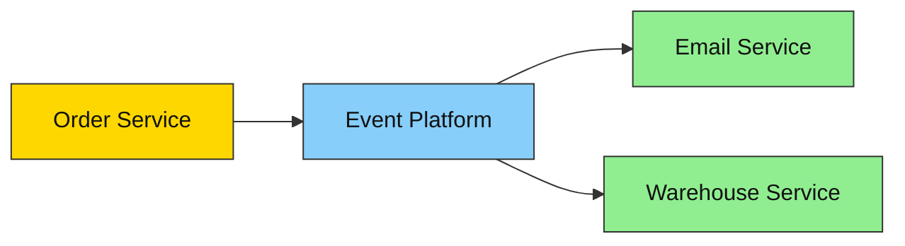

---

### Phase 4: Kafka stores messages in topics
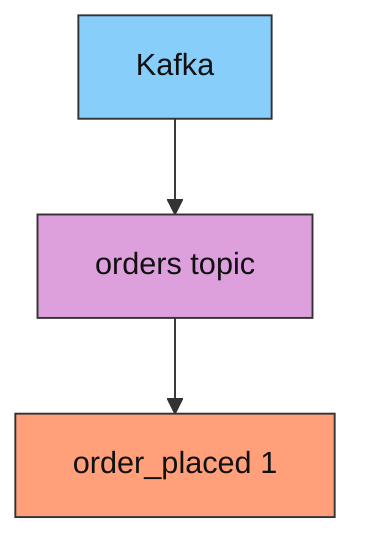

---

### Phase 5: Topic with offsets
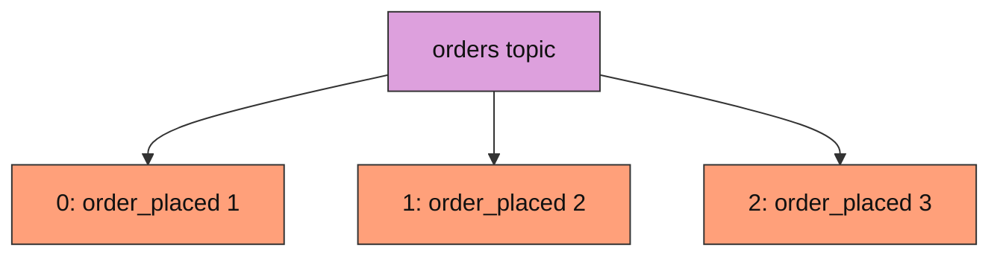

---

### Phase 6: Consumers with IDs
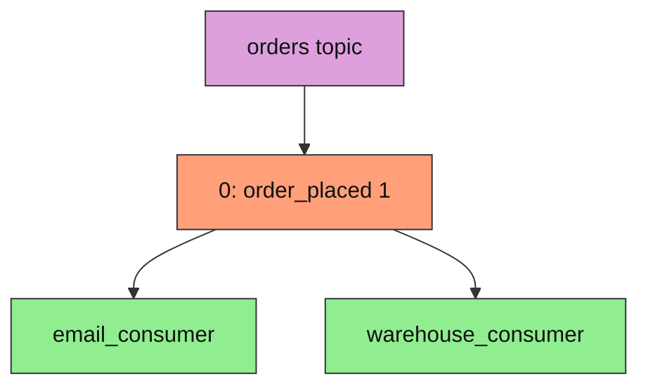

---

### Phase 7: Polling new messages
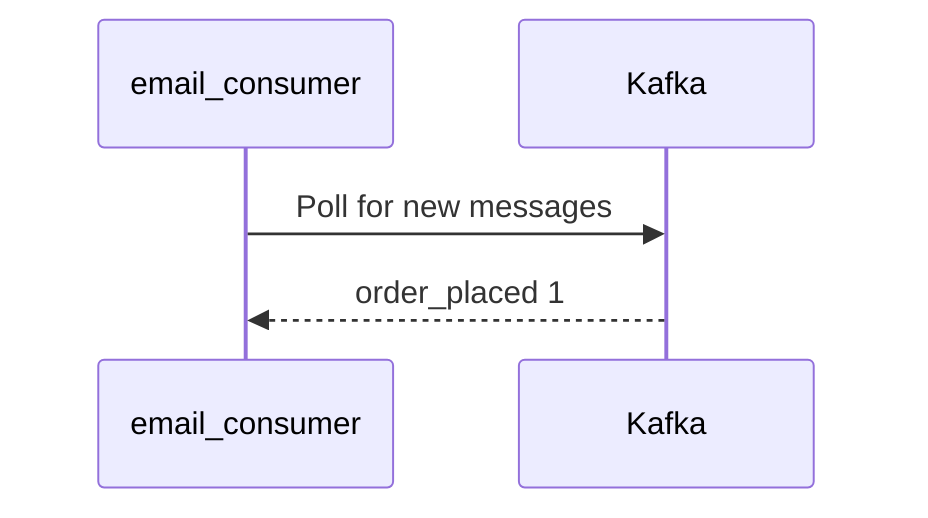

---

### Phase 8: Commit offset
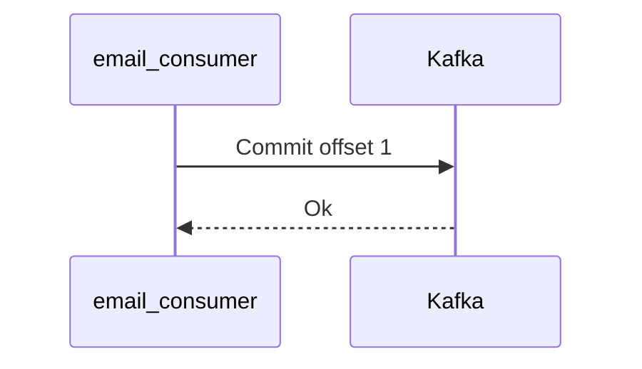

---

### Phase 9: Consume multiple messages

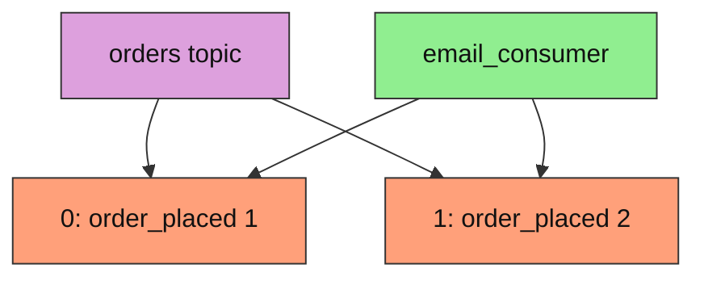

## Events as Messages
When we pass an event from one place to another, it is a message.
Kafka not only facilitates the storage of events, but also the passing of events from
one place to another.

Therefore, Kafka uses the term “messages” for events.

# How Does Kafka Facilitate Event Streaming?
Kafka stores durable and scalable logs of messages.
- It allows applications to produce messages to the log.
- It allows applications to consume messages from the log.
- It allows the messages to be stored for as long as required

## Kafka Topic with Message Offsets
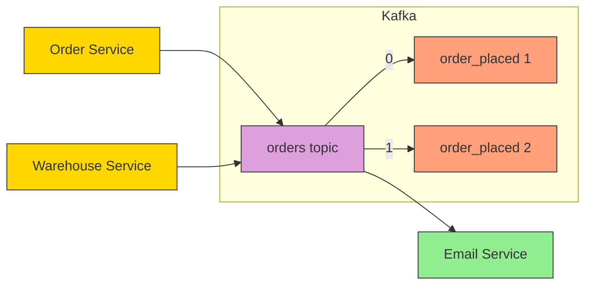

## 3. Kafka Cluster with Partitions
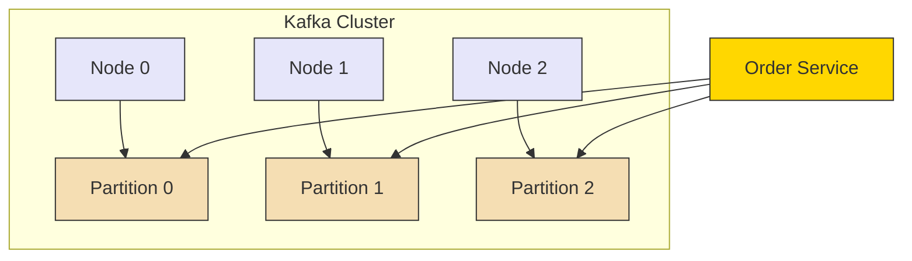

## 4. Consumer Polling and Offset Commit
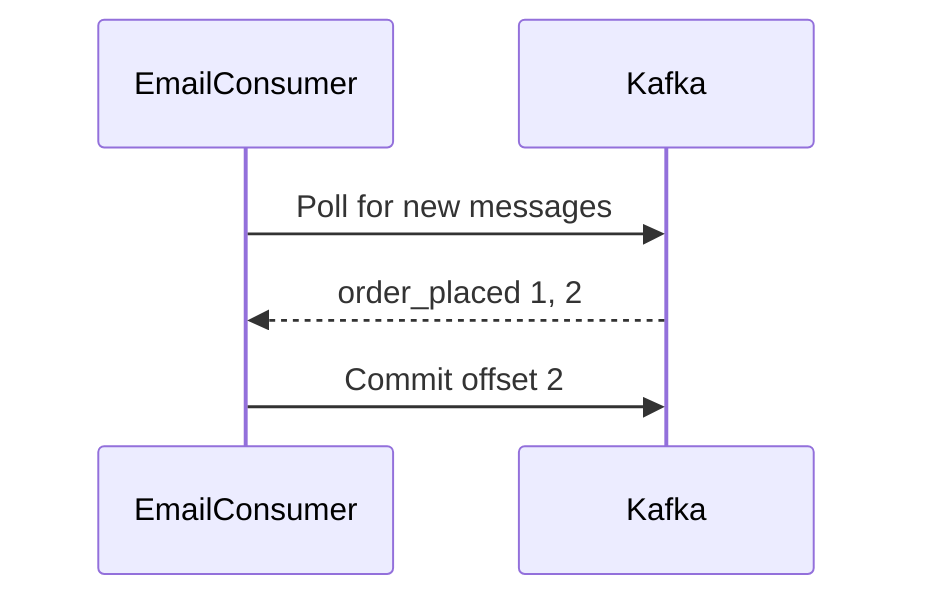

## 5. Replication for Durability
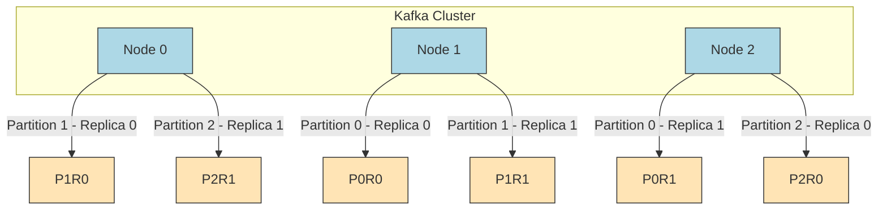
