# Kafka Basics

**What is Kafka?**
Kafka is a system designed for processing real-time data streams.

What is an Event?
An event is a piece of information captured at a specific moment.
Examples include:
- A record of a product being bought, saved in JSON format.
- A full snapshot of a database entry after an update (CDC).
- A simple log message from an app.

## Understanding Event Streaming?
Event streaming means constantly sending out and receiving events as they happen — like a real-time flow of updates between services or systems.

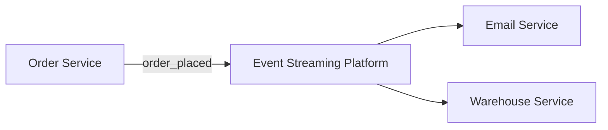

## Events as Messages

When an event is passed from one place to another, it is a message.  
Kafka not only facilitates the storage of events but also the passing of events between services.  
*Terminology note:* In Kafka, events are called “messages.”

## How Does Kafka Facilitate Event Streaming?

Kafka enables event streaming by:

- Storing durable and scalable logs of messages.
- Allowing applications to produce messages to the log.
- Allowing applications to consume messages from the log.
- Permitting messages to be stored for as long as required.

## Event Streaming in Kafka (Topics and Offsets)

Kafka stores logs of messages in what are called topics. For example, the "orders topic" holds messages with sequential offsets. One diagram on this page shows a message at offset 0 (with subsequent offsets 1, 2, etc.).

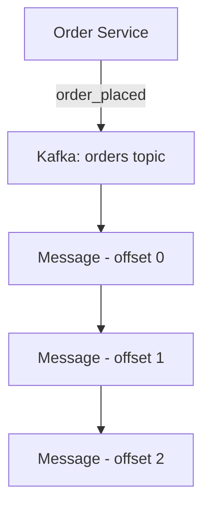

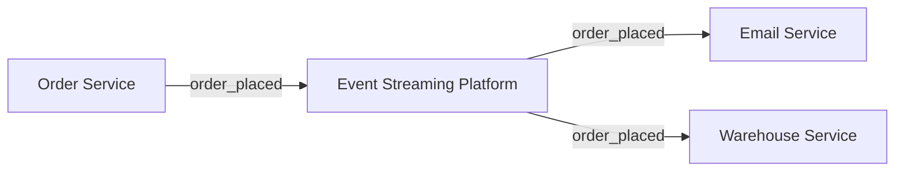

## Event Streaming in Kafka (Consumers with IDs)

Kafka tracks which offset a given consumer has processed. In this diagram, each consumer (with an associated ID) consumes messages from the topic.

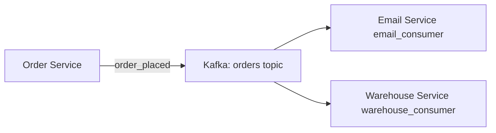

## Event Streaming in Kafka (Polling)

Consumers poll Kafka for new messages. The diagram (similar to previous ones) indicates that a consumer repeatedly checks the topic, receives new messages, and then processes them.

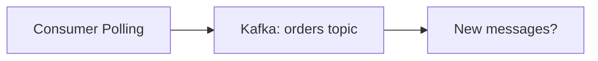

## Event Streaming in Kafka (Committing Offsets)

After consuming messages, consumers tell Kafka to update (or commit) the offset. This ensures Kafka knows which messages have been processed.

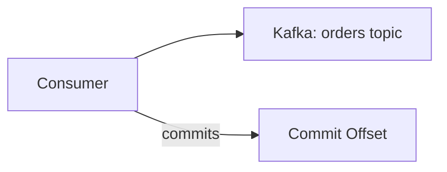

## Event Streaming in Kafka (Multiple Events)

Consumers can process multiple messages per poll. This page illustrates sequential consumption of several messages.

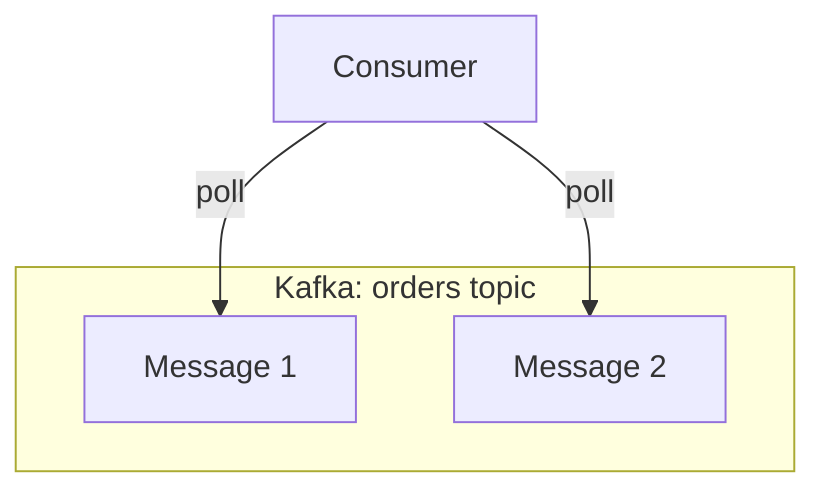

## Durable and Scalable

Kafka’s design ensures that:
- **Durable:** Stored messages are resilient to failures.
- **Scalable:** The system can handle millions of messages per second and will not lose data even if a machine fails.

## Kafka Clusters

Kafka is designed to run as a cluster—a group of machines that coordinate with one another.

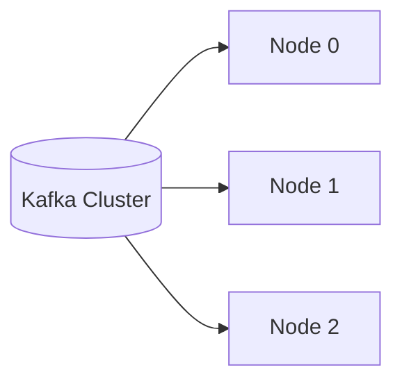

## Partitions

Every topic in Kafka consists of one or more partitions. This enables the topic’s data to be split and distributed across different nodes.
Partitions allow a topic to be split between multiple nodes in a Kafka cluster.

## Partitions (Scalability)
- Messages sent to a topic are distributed across partitions.
- Each message is assigned to a partition based on its key — this process is deterministic.
- If multiple messages have the same key, they will always go to the same partition.
- This ensures that message ordering is preserved within a partition.
- Partitions allow Kafka to scale:
  - They distribute load across multiple nodes.
  - Consumers can be parallelized — one per partition, for better throughput.
  - 

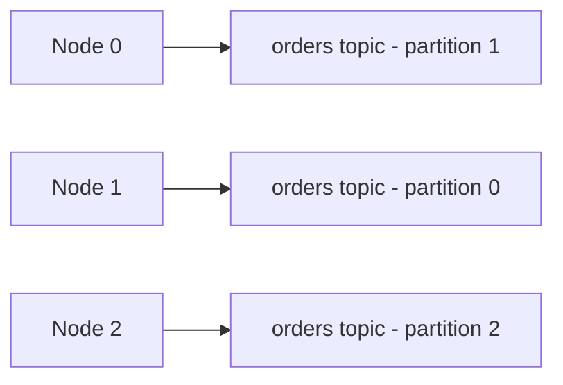

## Partitions (Consumer Parallelism)

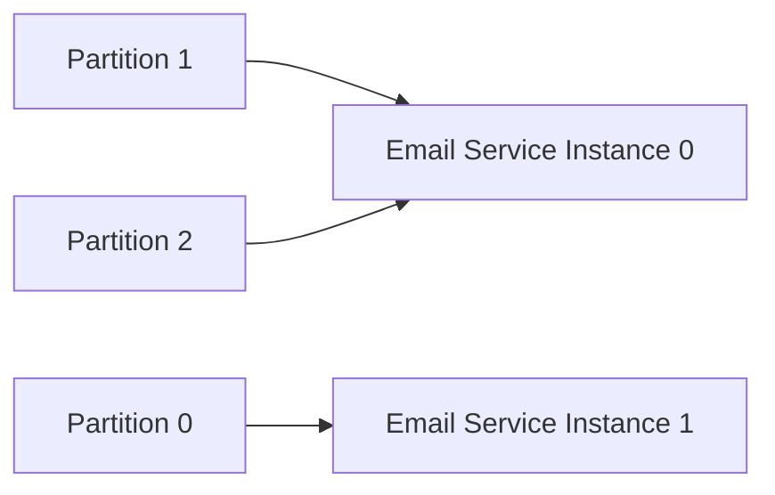

## Partitions: Durability and Replication

- Each partition is replicated across multiple nodes in the Kafka cluster.
- This replication provides fault tolerance.
- If a node goes down, Kafka can continue operating using the replicas on other nodes

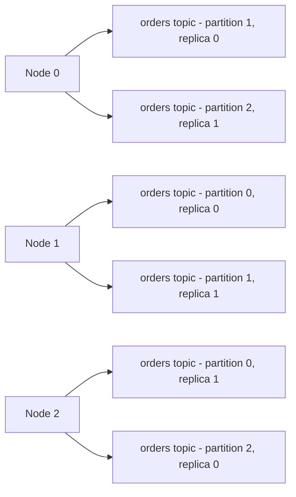
