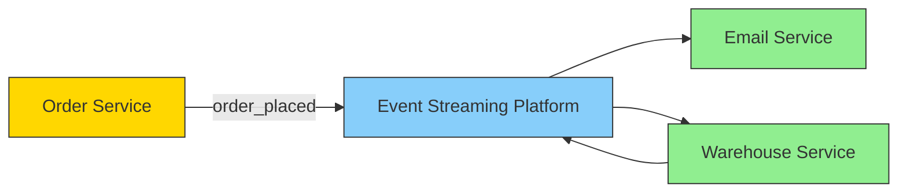
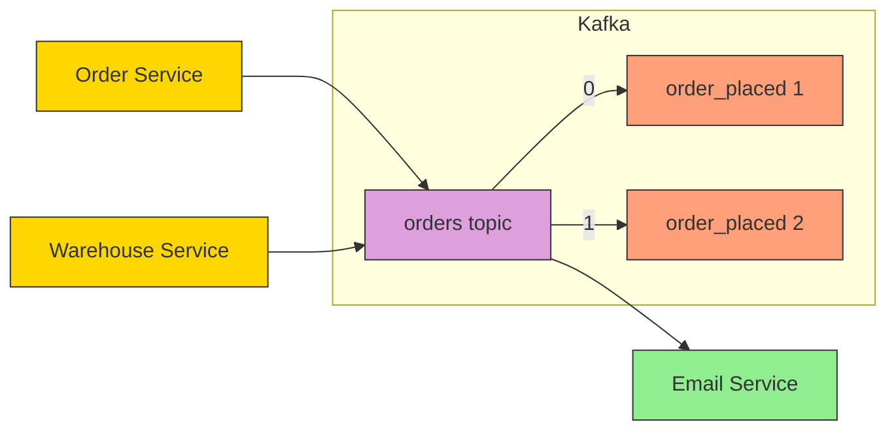
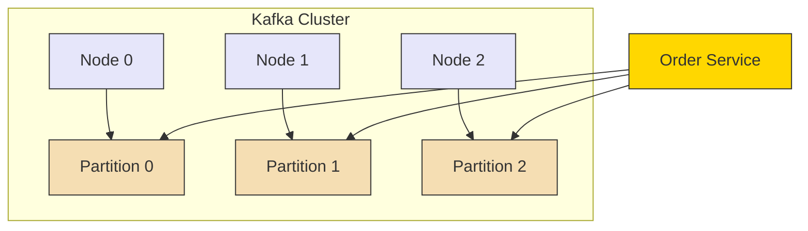
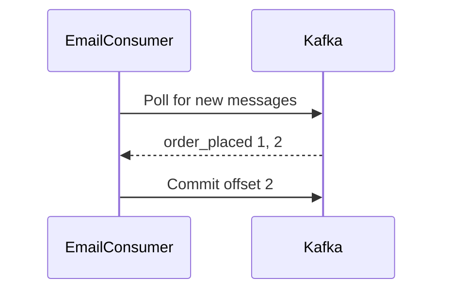
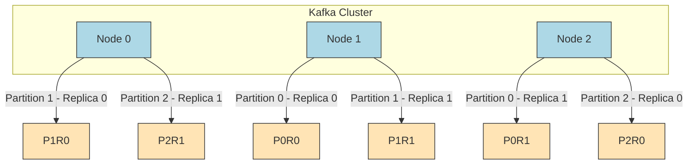

# Kafka Basics

**What is Kafka?**
Kafka is a system designed for processing real-time data streams.

What is an Event?
An event is a piece of information captured at a specific moment.
Examples include:
- A record of a product being bought, saved in JSON format.
- A full snapshot of a database entry after an update (CDC).
- A simple log message from an app.

## 1. Understanding Event Streaming?
Event streaming means constantly sending out and receiving events as they happen — like a real-time flow of updates between services or systems.

## 2. Kafka Topic with Message Offsets

## 3. Kafka Cluster with Partitions

## 4. Consumer Polling and Offset Commit

## 5. Replication for Durability

